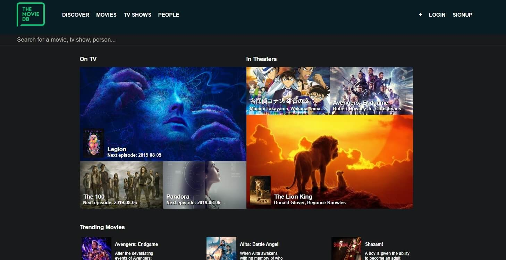
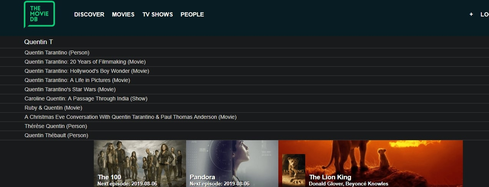
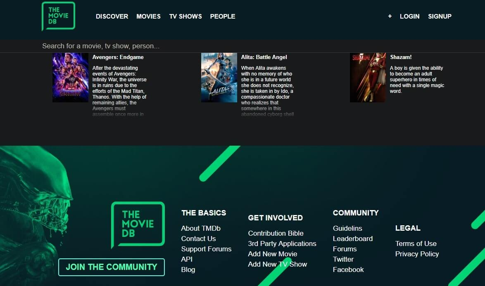
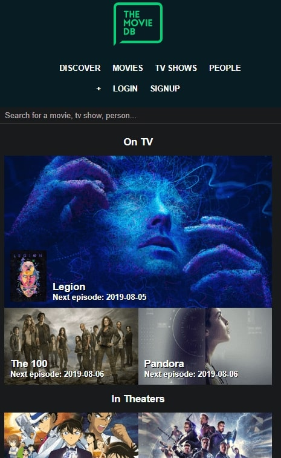
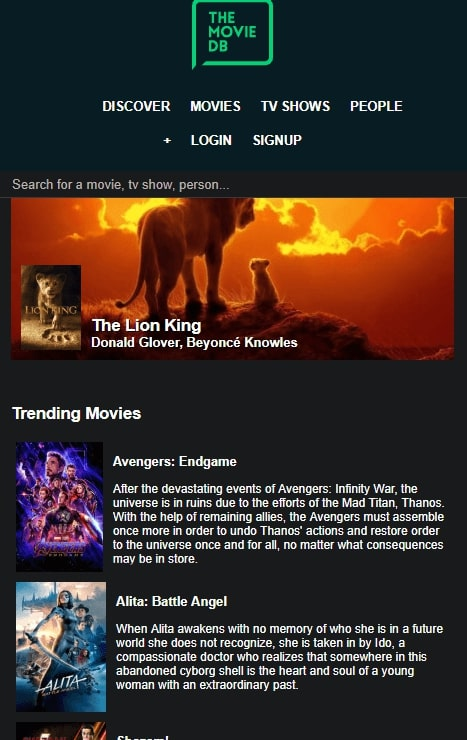
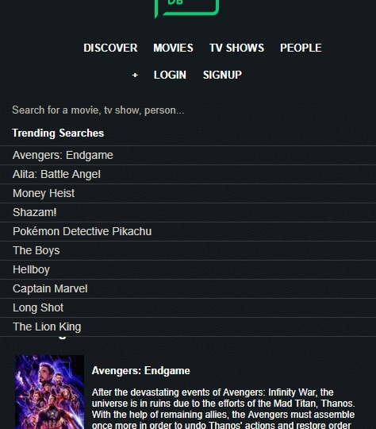

# the_movie_db
Movie db with plain html/css/JS/Webpack

## Why I picked plain HTML/CSS/JS/Webpack And What I've Learned

- To understand the impact of module bundlers, such as webpack, to a project.
- To further extend my CSS and JS, and JS DOM manipulation knowledge.

Webpack:
- Webpack allows your tools, such as Preprocessors like SCSS, to run automatically without a terminal command.
- Webpack allows code splitting and bundling; you can split your code into multiple files/modules and webpack will bundle them all in one file when you run the project.
  Bundling will decrease the time for the site to load as the browser doesn't need to retrieve many individual files.
  Webpack also allows you to import images and SCSS/CSS files into JS via loaders/plugins.
- Webpack offers optimization benefits. Such as tree-shaking by default, which disregards unused code and unused imports;
  Minify which removes any redundant white space and tokens like semicolons/curly braces/etc.
  Uglify, which turns your code into 'unreadable' form for devs so that it's lighter and easier to load;
- Babel to transpile ES6 JS code to older versions, and polyfill ES6 JS features (eg; Promises) to older versions.
- Learned how to utilize npm scripts (a task runner) in package.json.


Optimization out of webpack:
- Always compress images when you can. An image compressor site such as [TinyPng](https://tinypng.com/) works.
- Browser cache (which you have to do nothing to implement it), Server Side Cache (Back-end, when a lot of users request the data, a cache is already made in the server to speed up the process),
 CDN Cache (Back-end, CDN moves your content to nearby servers to speed up data retrieval).
- Always gzip (compress) your files. (Back-end job because it requires you to access the server host files)
- Browser Cache using ServiceWorkers. Allows you to control what to cache (Not in this project, I decided to skip it, not needed).
  Note: As of August 2019, it is not supported in IE11. Use at own expense.
- If a JS library or a JS script becomes a performance issue and you don't need it at a certain screen breakpoint, you could set media queries in your HTML to load certain JS libraries/files.

Chrome Console (When you click 'inspect element'):
- Learned how to read the waterfall chart. (Reference: https://www.keycdn.com/blog/waterfall-analysis)

JS Design Pattern:
- MVC (Model, View, Controller).
- Model stores business logic and data.
- View allows DOM manipulation.
- Controller is the bridge for the data and the model.
- Classes are used because features such as dependency injection, inheritance, (and maybe more?) are used at certain scenarios.

JS:
- Follows Airbnb's lintng.
- Lazy loading using InterSectionObserver; Lazy loading will load images if you scroll down to where the image is, which saves unnecessary downloads on images that are not seen.
  IntersectionObserver offers a better solution than checking the user's scroll location every time to trigger something.
  IntersectionObserver only triggers when the user is going to intersect a section, it also knows it for the entire browser's lifecycle, making InterSectionObserver more efficient.
  Note: As of August 2019, it is not supported in IE11. Use at own expense.

CSS:
- Grids.

Things to improve on:
- Learning CSS animations and transitions.
- Type Checkers could be utilized.
- Unit testing.

## What It Looks Like







## Getting Started

These instructions will get you a copy of the project up and running on your local machine for development and testing purposes. See deployment for notes on how to deploy the project on a live system.

Clone the project. Use `npm install` to install all the dependencies. Run the project with `npm run develop` for development or `npm run build` for production.
Note: the name 'develop' and 'build' could be configured and renamed in package.json.

### Prerequisites

What things you need to install the software

```
- Any package manager (npm, yarn)
```

## Versioning

None
